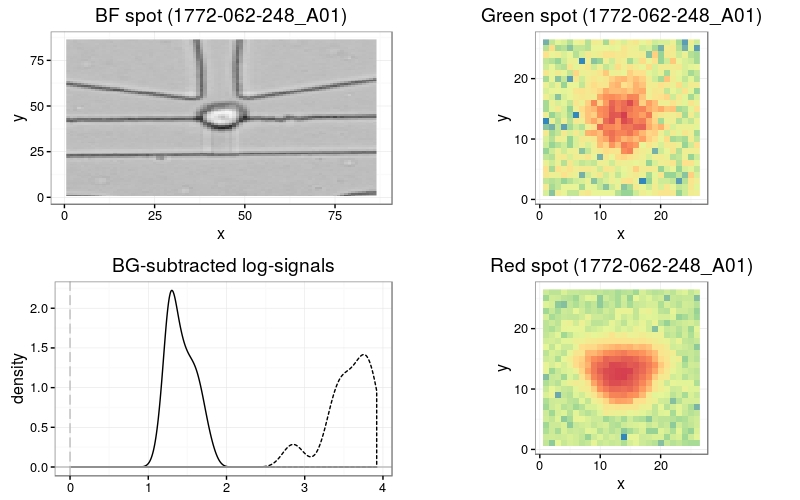
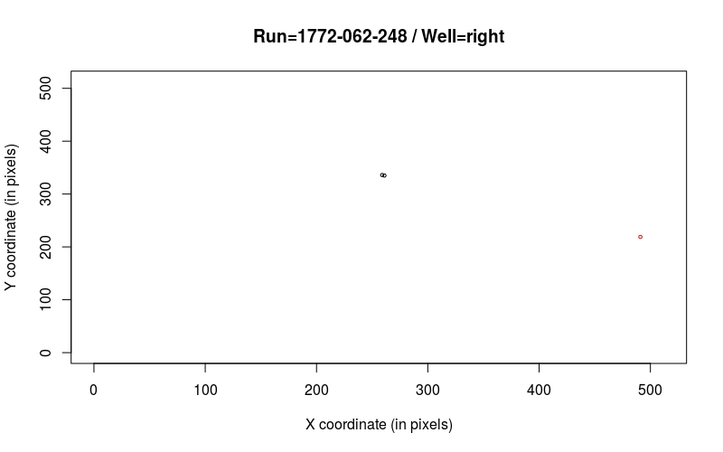
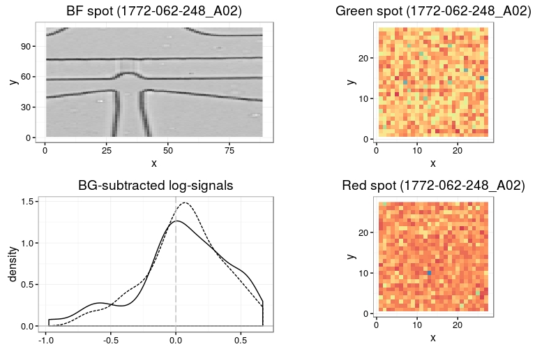
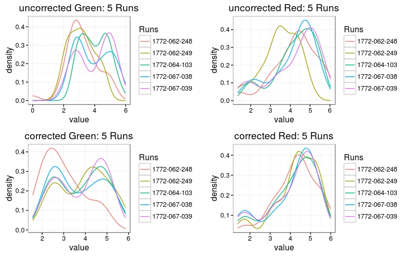
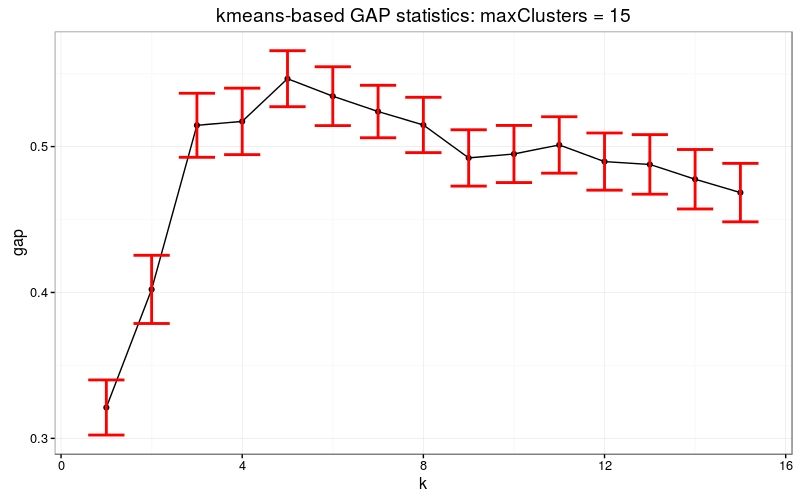
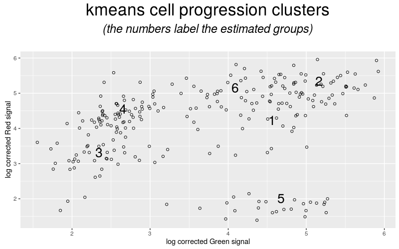
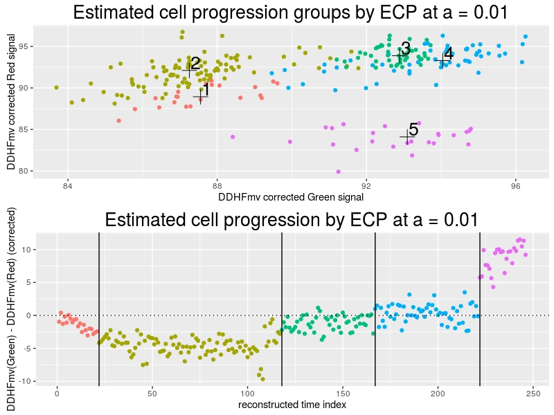
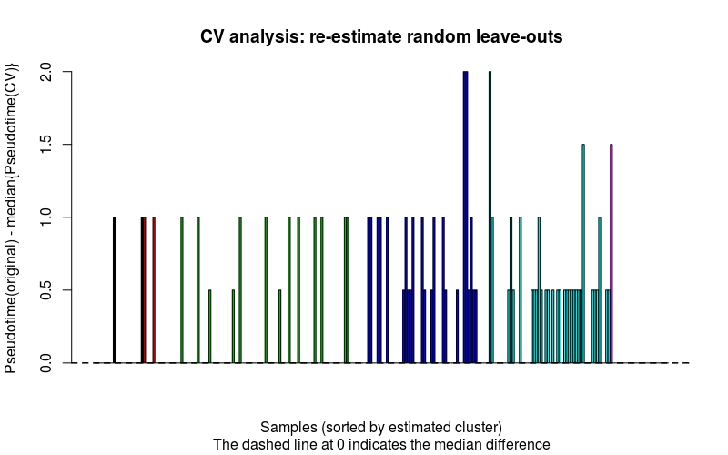
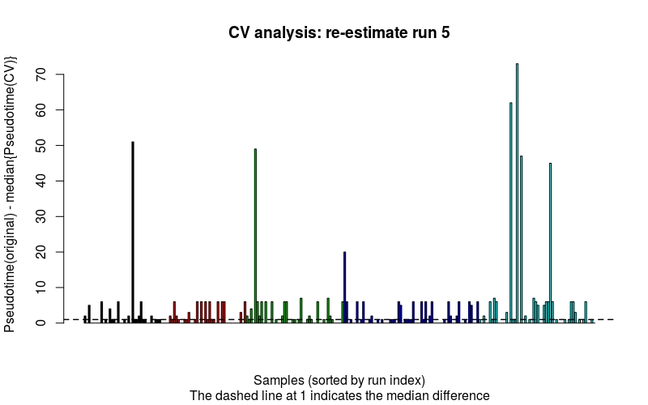

# Preliminaries
`r Biocpkg("CONFESS")` is a customized cell detection and signal estimation model for images coming from the Fluidigm C1 system. Applied to the HeLa `r Biocexptpkg("CONFESSdata")` dataset, our method estimated the cell cycle phase of hundreds of samples from their fluorescence signals and enabled us to study the spatio-temporal dynamics of the HeLa cell cycle.

## Loading the packages
To load the `r Biocpkg("CONFESS")` package:
```{r,warning=FALSE,message=FALSE}
library(CONFESS)
```

## Data pre-processing
The sample set of 14 raw C01 images are available in the `r Biocexptpkg("CONFESSdata")` package on Bioconductor. Alternatively, the complete set of 378 images can be downloaded [here](http://single-cell.clst.riken.jp/bluk_download/cell_images/). They include images for each of the following sets: 
- Bright Field (BF) images [RawSC_BF.zip](http://single-cell.clst.riken.jp/bluk_download/cell_images/RawSC_BF.zip)
- Red & Green Channels (Ch) images [RawSC_red_green.zip](http://single-cell.clst.riken.jp/bluk_download/cell_images/RawSC_red_green.zip)

`r Biocpkg("CONFESS")` can take as input raw BMP or JPEG image files, or text-converted files. C01 files can be coverted with an external program like [ImageJ (Fiji)](http://fiji.sc/Fiji).

To do the conversion with Fiji, go to ImageJ (Fiji): Process --> Batch --> Convert, with the following options:
"Output format"=Text Image. "Interpolation"=Bilinear and "scale factor"=1. Select the option "Read Images using Bio-Formats" and "convert". You should get all txt files.

# Fluorescence estimation

## Reading in image/text files
The function ```readFiles``` reads the image/text filenames. If image data is used, all images should be in a single directory referenced by ```iDirectory```. ```BFdirectory``` and ```CHdirectory``` would then reference the output directory for the Bright Field and Channel images. If the image files have been converted to text, iDirectory can be left empty, and ```BFdirectory``` and ```CHdirectory``` will now point to the input text files folders. These data should be stored in two different folders. This function will also report (and discard) any inconsistencies in the files being read (eg. BF file present but missing Red/Green channel).
```separator``` separates the image type (BF and channel characteristic types defined in ```image.type```) from the rest of the sample name ID (consisting of the run ID and the well ID). A typical example of a sample name that is separated by "_" from the image type is the .C01 Bright Field image "1772-062-248_A01_BF.C01". String "1772-062-248_A01" is the joined Run and Well ID (also separated by "_"). At this function though separator refers to the one separating "1772-062-248_A01" and "BF.C01" strings.

In this example, we read text-converted files available in the `r Biocexptpkg("CONFESSdata")` package.
```{r,eval=FALSE}
library(CONFESSdata)
data_path<-system.file("extdata",package="CONFESSdata")
files<-readFiles(iDirectory=NULL,
                  BFdirectory=paste(data_path,"/BF",sep=""),
                  CHdirectory=paste(data_path,"/CH",sep=""),
                  separator = "_",image.type = c("BF","Green","Red"),
                  bits=2^16)
```

## Image spot estimation
To estimate the spots we need to specify a set of parameters. ```correctionAlgorithm``` should be ```FALSE``` in this estimation stage. If the parameter subset is not defined, all files read in with the ```readFiles``` function will be analysed. ```foregroundCut``` defines a series of cut-offs that separate the spot (a potential cell) from the background. The cut-offs are empirically picked. For this reason, it is often helpful to train the dataset by picking a subset of well-defined, single-spot images and check the algorithm's performance using different values (e.g. the above vs seq(0.8,0.96,0.02)). In noisy data we have found that low cut-offs produce the best results. If the spot's fluorescence signal is too weak to be detected or simply the cell is not present, `r Biocpkg("CONFESS")` will perform capture site recognition (BF modeling) to estimate the pixel coordinates of the spot that, here, it is assumed to have a rectangular shape. The size of the side of this pseudo-spot is defined by ```BFarea```. The signal is then quantified within this area. Note that only in BF modeling the spot is assumed to have a rectangular shape. Otherwise we do not make any assumptions on the shape and the size of the spot. 
```{r,eval=FALSE}
estimates <- spotEstimator(files=files,foregroundCut=seq(0.6,0.76,0.02),
                        BFarea=7,correctionAlgorithm=FALSE,savePlot="screen")
```


## Quality control (identification of outliers)
The next step uses visual and statistical inspection tools for the identification of
possible outliers. The spot estimates (of the samples stored in ```estimates```) enter in the function
through ```defineLocClusters```. 

The way of processing these data is controlled by out.method whose possible values are: 

* ```interactive.clustering``` : estimates concentric circles that mark the outliers (e.g. all dots outside the circle with with a particular radius are outliers)
* ```interactive.manual``` : enables the user to select the outliers manually by point-and-click on the plot. 

The function mainly produces run- and well- specific plots that enable the user to pick outlier locations. We have noticed that the Well IDs exhibit specific directionality (half of them are facing right and the rest left) that affects the position of the capture site. The output integrates the first-step estimates and the quality control. The code below shows the quality control process under ```interactive.manual```. ```interactive.clustering``` requires at least 15 samples in each run- / well- category (it will exit with an error here). When applied on all data, it enables the user to select outliers by entering a pre-calculated radius in an auto-generated message similar to the one below.  
```{r,eval=FALSE}
clu <- defineLocClusters(LocData=estimates,out.method="interactive.manual")
#"Hit Enter to move to the next image or A + Enter to Abort:"
```


Option ```interactive.manual``` enables the user to select suspicious data manually by point-and-click on the plot. The algorithm will select _**the closest spot only once **_ of the location that has been selected by the point-and-click (thus in closely located spots one can click as many times as he wants around to make sure that everything is selected). In Windows the user clicks on any number of spots that could be potential outliers and completes the procedure by clicking on the 'Stop' button appearing on the top/left of the console. In Linux/Mac the 'Stop' button is replaced by right clicking anywhere on the image. In Rstudio the process stops with the 'Esc' button.

**Important Note**: Please follow the pipeline's instructions on how to stop this process at any time you wish. Closing the plot window may cause a fatal error and abnormal exit. To stop the process simply press A and Enter (Abort) when prompted!

## Re-estimation step (for outliers)
The selected samples now undergo BF modelling using ```spotEstimator``` with ```correctionAlgorithm
= TRUE```. The potential outliers that had been originally estimated by BF modelling are not re-estimated.
They are only kept in a separate slot for manual inspection by our graphical tools. ```QCdata``` contains the output of the quality control step. ```median.correction=TRUE``` instructs the function to shift all locations with outlier BF modeling estimates (more than ```cutoff=50``` pixels away from the bulk of the estimates) to the median of the bulk estimates (denoted as ```confidence``` in the output table).
```{r,eval=FALSE}
estimates.2 <- spotEstimator(files=files,subset=clu$Outlier.indices,
                             foregroundCut=seq(0.6,0.76,0.02),correctionAlgorithm=TRUE,
                             cutoff=50,QCdata=clu,median.correction=TRUE,
                             savePlot="screen") 
```                         


## Final estimation
The final output is given by ```LocationMatrix}. Apart from listing the locations and the signal estimates, 
it quantifies the cell existence via a set of user defined filters. The possible filters are:

* Size: it keeps spots whose size is higher than a cut-off, for example ```filter.by = matrix(c("Size",50),ncol=2)``` with the cut-off being 50 pixels.

* Estimation.Type: it keeps spots that have been estimated only by Fluorescence-based estimation (i.e. it excludes BF modeling based estimates), for example ```filter.by = matrix(c("Estimation.Type","Fluorescence-based"),ncol=2)```.

* Pvalue: it keeps spots whose Pvalue for the signal-to-noise ratio (being significant) IN AT LEAST ONE CHANNEL is higher than a cut-off, for example ```filter.by = matrix(c("Pvalue",0.01),ncol=2)``` will keep all spots with sufficiently low P-values in at least one channel. 

* FDR: keep the spots whose FDR adjusted Pvalue for the signal-to-noise ratio (being significant) IN AT LEAST ONE CHANNEL is higher than a cut-off, for example ```filter.by = matrix(c("FDR",0.01),ncol=2)```. 

* StN: keep the spots whose signal-to-noise ratio IN AT LEAST ONE CHANNEL is higher than a cut-off, for example ```filter.by = matrix(c("StN",1),ncol=2)```.

* Pvalue/(image.type): keep the spots whose Pvalue for the signal-to-noise ratio (being significant) OF A PARTICULAR CHANNEL is higher than a cut-off. The channel ID replaces the '(image.type)' expression. The channel IDs are user defined in ```readFiles```. For example, ```filter.by = matrix(c("Pvalue/Green",0.01),ncol=2)``` will keep all spots with sufficiently low P-values at the Green channel.

* FDR/(image.type): keep the spots whose FDR adjusted Pvalue for the signal-to-noise ratio (being significant) OF A PARTICULAR CHANNEL is higher than a cut-off (see above). For example, ```filter.by = matrix(c("FDR/Green",0.01),ncol=2)```.

* StN/(image.type): keep the spots whose signal-to-noise ratio OF A PARTICULAR CHANNEL is higher than a cut-off (see above). For example, ```filter.by = matrix(c("StN/Green",1),ncol=2)```.

* Out.Index: keep the spots that are estimated with confidence (remove outliers), for example, ```filter.by = matrix(c("Out.Index","confidence"),ncol=2)```. 

* Other.Spots: keep the spots of high quality images, i.e. images where the algorithm does not find any unmatched spots (across channels) or the number of matched spots is lower than a cut-off. For example, ```filter.by = matrix(c("Other.Spots",0),ncol=2)``` will keep the images that contain only matched spots across channels.  


A typical example of filtering with more than one filter is the following:
```{r}
Results <- LocationMatrix(data=estimates.2,
                          filter.by = matrix(c("FDR","Out.Index",0.005,"confidence"),ncol=2))
Results$Output[1:3,]
```

This will keep all 'confident' spots with FDR adjusted P-value < 0.005 (in any of the channels). The filters allow the 'spot' to 'cell' transition by quantifying certain properties that only cells should have. The output of ```LocationMatrix``` should always be manually curated via inspection of the ```spotEstimator``` plots.  

The output table summarizes the estimates of the image analysis step. Most of the columns are self-explained. 'fore' corresponds to foreground (spot) and 'back' to the background signal. 'Other.Spots' indicates whether `r Biocpkg("CONFESS")` the location of all other spot signals found in a particular image. In the example of sample '1772-062-248_A03' it notifies us that it estimated the location 'X = 30, Y = 204' in the Green channel and  'X = 262, Y = 368' in the Red Channel (the latter has been correctly kept as reliable in the X, Y columns). Finally 'Cells' is the transition column that reports predicted cells (marked with 1s) via the various filters that we set.   

# Fluorescence adjustment and estimation of cell cycle phases / pseudotime #

## Fluorescence adjustment on estimations from Section 2.6
To perform signal adjustment we use the relevant data of the previous step.
```{r}
# step1 <-createFluo(Results) #from previous section's results
step1 <- createFluo(from.file=system.file("extdata", "Results_of_image_analysis.txt", 
                                        package = "CONFESS"),separator="_")
```

```separator``` separates the run from the well ID and it is kept here because ```createFluo``` can be based on data from a file that is not necessarily obtained from the above process (but it should have the above format!). 

## Data inspection by batch (chip)
In ```step1``` we store the sample IDs, the raw fluorescence signals, the areas and the Run IDs of
all reliable samples into a list. We can quickly check the distribution of the signals by run/batch using the following commands:
```{r}
print(unique(step1$batch))
```

### If data consists of more than 1 chip run/batch
This step would perform signal adjustment by ```BGmethod="normexp"``` for image background within a mixtures of regression model with maximum ```maxMix=3```  mixture components (the optimal number is estimated) that is also correcting for the run (batch) effects. Plots will be generated to show how each channel has been normalized and adjusted. The ```seed``` parameter serves only for reproducibility of the results.
```{r,eval=FALSE,results="hide"}
step2<-Fluo_adjustment(data=step1,transformation="log",maxMix=3,prior.pi=0.1,
                       flex.reps = 50, single.batch.analysis=5,
                       savePlot="screen",seed=999)
```


Data will now be clustered and the group numbers will be labelled on the centroids.

```{r,fig.show="hide"}
step2.1<-getFluo(data=step2)
step3<-Fluo_inspection(data=step2.1,fixClusters=0,altFUN="kmeans",
                       k.max=15,B.kmeans=50,savePlot="screen")
```



The user should select the starting cluster, i.e. the start of the progression path. In circular paths like this one (representing a cell cycle process) any cluster can serve as starting. In this example, we select the bottom/left one (```path.start=3```) that is well-separated from the previous and looks like a starting point. ```pathEstimator``` will estimate the progression path assumed to progressing in a 'clockwise' and 'circular' manner.

```{r,fig.show="hide"}
step3.1<-pathEstimator(step3,path.start=3,path.type=c("circular","clockwise"),
                       joinedGroups=NULL)
step4<-Fluo_modeling(data=step3.1,init.path=step3.1$Path,VSmethod="DDHFmv",
                     CPmethod="ECP",CPgroups=5,CPpvalue=0.01,CPmingroup=10)
step5<-Fluo_ordering(data=step4,savePlot="screen")
```


```step4``` and ```step5``` contain the main analytical steps that perform both cell ordering and cluster estimation by fluorescence signal. The plots show the distinct clusters (top) and the channel differences by estimated pseudotime (bottom). The data have been transformed by ```VSmethod="DDHFmv"``` and the change-point analysis was run by ```CPmethod="ECP"``` that identifies distinct clusters at significance level ```CPpvalue=0.01```. The main output of ```Fluo_ordering``` is the following table with the estimates of interest:  

```{r}
head(step5$Summary_results,3)
```

### If data consists of a single chip run/batch
If the data come from a single run, ```Fluo_adjustment``` is replaced by ```getFluo_byRun``` that performs only image background correction. The rest of the steps are as before. Note that in the example code below, we run the analysis on a subset of the original data, i.e. only those coming from ```batch=1```. The data have been selected by ```FluoSelection_byRun``` that can be used to select either specific batch(es) or specific data across all batches. An example of the latter is provided in the next section.  
```{r,eval=FALSE}
step1.1<-FluoSelection_byRun(data=step1,batch=1)
step2<-getFluo_byRun(data=step1.1,BGmethod="normexp",savePlot="screen")
step3<-Fluo_inspection(data=step2,fixClusters=0,altFUN="kmeans",k.max=15,
                       savePlot="screen")
step3.1 <- pathEstimator(step3,path.start=2,path.type=c("circular","clockwise"))
step4 <- Fluo_modeling(data=step3.1,init.path=step3.1$Path,VSmethod="DDHFmv",
                       CPmethod="ECP",CPpvalue=0.01)
step5<-Fluo_ordering(data=step4,savePlot="screen")
```

## Cross-validation to assess the stability of the estimates 
It takes the initial data (step1) and automatically runs all steps step2 - step4 above for one or more reference runs (single.batch.analysis). The reference run defines which run we use to adjust the data at ```Fluo_adjustment()```)  Finally, cross-validation is done with ```Fluo_CV_modeling```.

1. remove samples at random and generates 'new clusters'
2. put back the excluded samples and re-estimate them (based on the 'new clusters') 
3. Repeat this B > 2 times (B = 2 is too little)
4. summarize and evaluate how different your full data estimates are from from cross-validation estimates  

```{r,eval=FALSE}
step1 <- createFluo(from.file=system.file("extdata", "Results_of_image_analysis.txt", 
                                        package = "CONFESS"))
steps2_4<-Fluo_CV_prep(data=step1,init.path = rep("bottom/left",2),
                       path.type=c("circular","clockwise"),maxMix=3,
                       single.batch.analysis = 5,transformation = "log",prior.pi = 0.1,
                       flex.reps=5,areacut=49,fixClusters=0,altFUN="kmeans",
                       k.max=15,VSmethod="DDHFmv",CPmethod="ECP",CPgroups=5,
                       B.kmeans=5,CPpvalue=0.01,CPmingroup=15,savePlot="OFF",seed=999)
steps2_4cv.1<-Fluo_CV_modeling(data=steps2_4,B=10,batch=1:4,perc.cutoff=0.6,q=0.9,
                               f=0.99,seed.it=TRUE,pseudotime.cutoff=20,savePlot="screen")
```


You can do the same thing by removing and re-estimating a whole batch. In ```Fluo_CV_modeling``` we must set ```B=1``` because the whole batch is removed once and there is no random samples to be excluded iteratively as above. The command below will remove and re-estimate batch 1.
```{r,results="hide",message=FALSE,fig.show="hide"}
steps2_4cv.2<-Fluo_CV_modeling(data=steps2_4,B=1,batch=1:4,perc.cutoff=0.6,q=0.9,
                             f=0.99,seed.it=TRUE,pseudotime.cutoff=20,savePlot="screen")
```


The output of ```Fluo_CV_modeling``` is a list with the results of the original estimates (```step5```) and the CV-based estimates. The latter are newly predicted pseudotimes and clusters by two methods: ```median / original``` and ```median / null```. They both integrate the information of the CV and the originally estimated pseudotimes by building kmean clusters of the ```B``` CV estimates for each sample i
and defining pseudotime(i) = median(pseudotime(set1,i)) where set1 is a subset of the ```B``` pseudotimes that exhibit some similarity. The similarity is assessed by k-means clustering. This subset should contain a large percentage of the ```B``` data (higher than a user defined cut-off) and it's median should be lower than the q-th (user defined) quantile of the average differences between the original and the CV-estimated pseudotimes across all samples. 

Under the former method, if the CV estimated pseudotimes do not satisfy the above requirements then the algorithm returns pseudotime(i) = median(pseudotime(set2,i)) where set2 is the cluster of ```B``` pseudotimes that minimizes |median (pseudotimes(set2,i)) - original.pseudotimes|. Under the latter method, if the CV estimated pseudotimes do not satisfy the above requirements then the algorithm returns pseudotime(i) = NULL. The NULL data should be removed from the analysis. Any of the above slots can be used in ```Fluo_ordering``` to obtain new / alternative results. 

